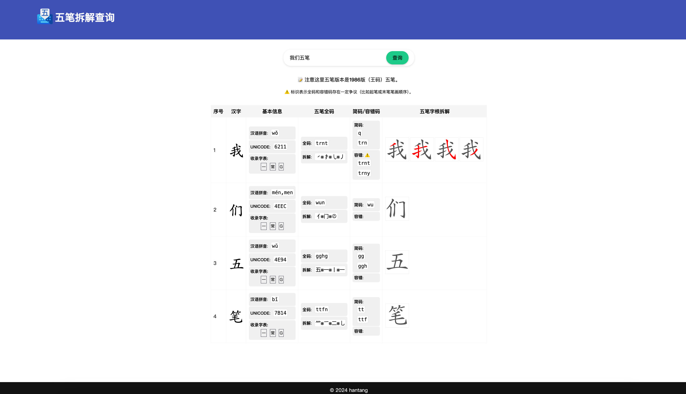

# 五笔拆解查询

## 说明

提供更加直观的五笔拆字图解。

## 数据相关

- 五笔编码，来自王码五笔，以及[rime/rime-wubi](https://github.com/rime/rime-wubi)、[KyleBing/rime-wubi86-jidian](https://github.com/KyleBing/rime-wubi86-jidian)、微软五笔等。
- 字根拆解和对应字体来自 [:link: 86wb.ysepan.com](http://86wb.ysepan.com)
- 汉字图形来自 [chanind/hanzi-writer](https://github.com/chanind/hanzi-writer)
- WIP: 结合汉字图形和字根拆解得到笔画拆解示意图来自本仓库作者。

## 其他

- 汉字跟打：
  - 玫枫跟打器 [KyleBing/typepad](https://github.com/KyleBing/typepad) / [:link: kylebing.cn/tools/typepad/](http://kylebing.cn/tools/typepad/)
  - 木易根打 [:link: typer.owenyang.top](https://typer.owenyang.top)
  - 添雨跟打器老版本: [taliove/tygdq](https://github.com/taliove/tygdq)
- 更多打字练习：
  - [RealKai42/qwerty-learner](https://github.com/RealKai42/qwerty-learner) / [:link: qwerty.kaiyi.cool](https://qwerty.kaiyi.cool)
  - [monkeytypegame/monkeytype](https://github.com/monkeytypegame/monkeytype) / [:link: monkeytype.com](https://monkeytype.com)
  - [gamer-ai/eletypes-frontend](https://github.com/gamer-ai/eletypes-frontend) / [:link: eletypes.com](https://www.eletypes.com)
  - [aradzie/keybr.com](https://github.com/aradzie/keybr.com) / [:link: keybr.com](https://www.keybr.com/)
  - [:link: typingclub.com](https://www.typingclub.com)
- 输入法资料：
  - [:link: ysepan.com 五笔输入法 86 版](http://86wb.ysepan.com)
  - [:link: ysepan.com 98 五笔资源库](http://98wb.ysepan.com)
  - [:link: ysepan.com 晓览-小拆五笔教程](http://gaokuan.ysepan.com)
  - [:link: ysepan.com 五笔 文件分享](http://wubi.ysepan.com)
- 工具：
  - 五笔编码查询 [:link: iamwawa.cn/wubi.html](https://www.iamwawa.cn/wubi.html)
