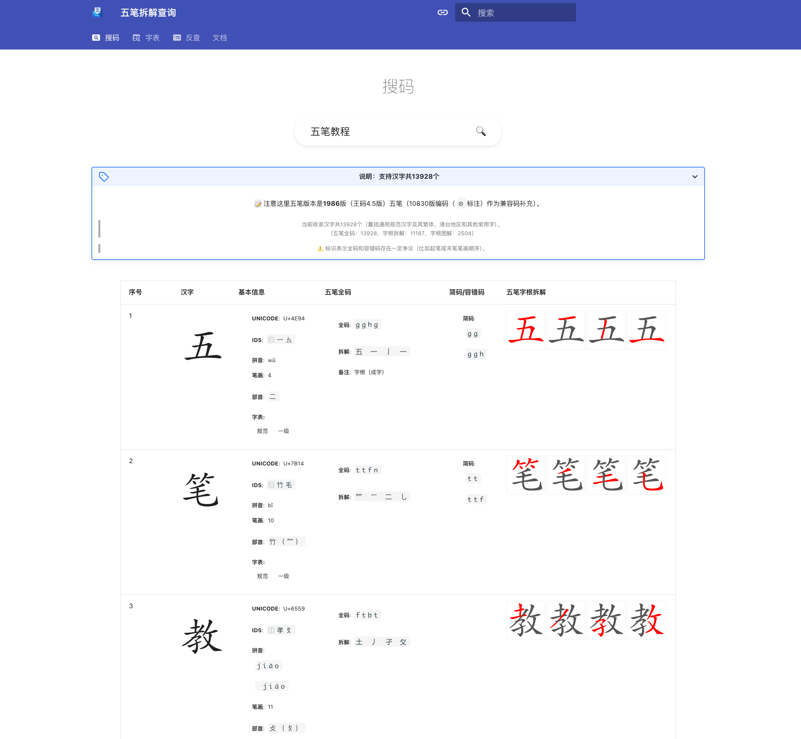

# 五笔拆解查询

## 说明

提供更加直观的五笔拆字图解。

带参数查询：

- `/search-wubi/?char=汉字`：查询汉字对应五笔图解
- `/search-wubi/code/?code=编码`：查询五笔编码对应的汉字、词组

## 数据相关

- 汉字范围：以《通用规范汉字表》（2013年6月）为基础（包括其中列举的 2000 多个繁体字），合并旧字表《现代汉语通用字表》、《简化字总表（1986 年）》等）、港台常用字、地名用字（涵盖到乡镇、街道和村、社区，来自民政部和国家统计局），以及其他表外常用字、网络常用字等（如数字`〇`、`囧`），共收 1.3 万多字。
- 五笔编码：参考王码五笔、[rime/rime-wubi](https://github.com/rime/rime-wubi)、[KyleBing/rime-wubi86-jidian](https://github.com/KyleBing/rime-wubi86-jidian)、[https://github.com/CNMan/UnicodeCJK-WuBi](https://github.com/CNMan/UnicodeCJK-WuBi)等方案聚合。
- 字频统计来自：
  - ~~北京语言大学刑红兵字频表（25 亿字语料）~~: [:link: blcu.edu.cn](https://faculty.blcu.edu.cn/xinghb/zh_CN/article/167473/content/1437.htm)
  - 语言生活绿皮书（中国语言生活状况报告）“年度媒体用字总表” [zispace/hanzi-greenbook](https://github.com/zispace/hanzi-greenbook)
  - 北京外国语大学-ToRCH 词频统计: [:link: bfsu.edu.cn](https://corpus.bfsu.edu.cn/info/1082/1782.htm )
  - 常用 1500 字：来自网络。
- 字根拆解和对应字体来自: [:link: 86wb.ysepan.com](http://86wb.ysepan.com)
- 汉字图形来自: [chanind/hanzi-writer](https://github.com/chanind/hanzi-writer)
- 汉字拆解图片来自 `https://wb98.com/wbcx/` (近 7000 字)
- 结合汉字图形和字根拆解得到笔画拆解示意图，来自本仓库作者。

## 补充资料

### 86 版五笔字根表

### 打字相关

- 汉字跟打：
  - 玫枫跟打器 [KyleBing/typepad](https://github.com/KyleBing/typepad) / [:link: kylebing.cn/tools/typepad/](http://kylebing.cn/tools/typepad/)
  - 木易根打 [:link: typer.owenyang.top](https://typer.owenyang.top)
  - 添雨跟打器老版本: [taliove/tygdq](https://github.com/taliove/tygdq)
- 更多打字练习：
  - [RealKai42/qwerty-learner](https://github.com/RealKai42/qwerty-learner) / [:link: qwerty.kaiyi.cool](https://qwerty.kaiyi.cool)
  - [monkeytypegame/monkeytype](https://github.com/monkeytypegame/monkeytype) / [:link: monkeytype.com](https://monkeytype.com)
  - [gamer-ai/eletypes-frontend](https://github.com/gamer-ai/eletypes-frontend) / [:link: eletypes.com](https://www.eletypes.com)
  - [aradzie/keybr.com](https://github.com/aradzie/keybr.com) / [:link: keybr.com](https://www.keybr.com/)
  - [:link: typingclub.com](https://www.typingclub.com)
- 输入法资料：
  - [:link: ysepan.com 五笔输入法 86 版](http://86wb.ysepan.com)
  - [:link: ysepan.com 98 五笔资源库](http://98wb.ysepan.com)
  - [:link: ysepan.com 晓览-小拆五笔教程](http://gaokuan.ysepan.com)
  - [:link: ysepan.com 五笔 文件分享](http://wubi.ysepan.com)
- 工具：
  - 五笔编码查询 [:link: iamwawa.cn/wubi.html](https://www.iamwawa.cn/wubi.html)
