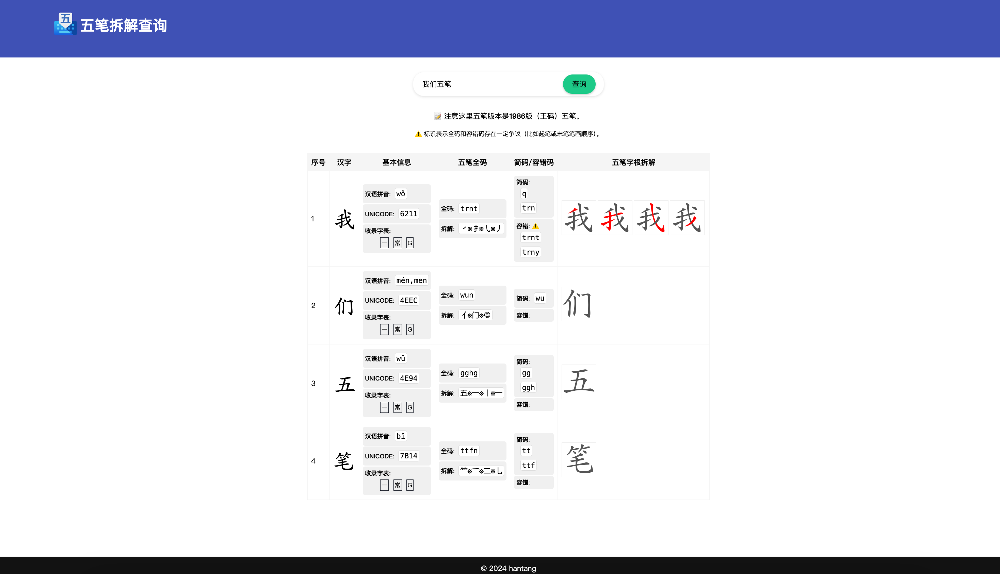

# 五笔拆解查询

## 说明

提供更加直观的五笔拆字图解。

## 数据相关

- 汉字：以《通用规范汉字表》（2012 年发布，共 8105 字，分三级）为基本，合并《现代汉语通用字表》（1988 年，共 7000 字）《信息交换用汉字编码字符集》（GB/T 2312-1980，汉字及偏旁部首共 6763 字），以及数字`〇`，共收 8246 个字。
- 五笔编码：参考王码五笔、[rime/rime-wubi](https://github.com/rime/rime-wubi)、[KyleBing/rime-wubi86-jidian](https://github.com/KyleBing/rime-wubi86-jidian)、微软五笔等方案聚合。
- 字频统计来自：
  - 现代汉语语料库字频表（2000 万字语料）: [:link: zhonghuayuwen.org](https://www.zhonghuayuwen.org/#/ylkzx/zyxz)
  - 北京语言大学刑红兵字频表（25 亿字语料）: [:link: blcu.edu.cn](https://faculty.blcu.edu.cn/xinghb/zh_CN/article/167473/content/1437.htm)
  - 常用 1500 字：来自打字网站，缺少字频。
- 字根拆解和对应字体来自: [:link: 86wb.ysepan.com](http://86wb.ysepan.com)
- 汉字图形来自: [chanind/hanzi-writer](https://github.com/chanind/hanzi-writer)
- :construction: WIP: 结合汉字图形和字根拆解得到笔画拆解示意图，来自本仓库作者。

## 补充资料

### 非规范汉字

| 汉字 | Unicode | 拼音    | 规范字           |
| ---- | ------- | ------- | ---------------- |
| 勩   | `52E9`  | `yì`    | 简化为“勚”       |
| 後   | `5F8C`  | `hòu`   | 简化为“后”       |
| 摺   | `647A`  | `zhé`   | 简化为“折”       |
| 鍾   | `937E`  | `zhōng` | 简化为“锺”或“钟” |
| 鬹   | `9B39`  | `guī`   | 简化为“鬶”       |
| 麴   | `9EB4`  | `qū`    | 简化为“麹”或“曲” |
| 卻   | `537B`  | `què`   | “却”的异体字     |
| 榘   | `6998`  | `jǔ`    | “矩”的异体字     |
| 疋   | `758B`  | `pǐ`    | “匹”的异体字     |
| 砦   | `7826`  | `zhài`  | “寨”的异体字     |
| 菸   | `83F8`  | `yān`   | “烟”的异体字     |

### 86 版五笔字根表

### 打字相关

- 汉字跟打：
  - 玫枫跟打器 [KyleBing/typepad](https://github.com/KyleBing/typepad) / [:link: kylebing.cn/tools/typepad/](http://kylebing.cn/tools/typepad/)
  - 木易根打 [:link: typer.owenyang.top](https://typer.owenyang.top)
  - 添雨跟打器老版本: [taliove/tygdq](https://github.com/taliove/tygdq)
- 更多打字练习：
  - [RealKai42/qwerty-learner](https://github.com/RealKai42/qwerty-learner) / [:link: qwerty.kaiyi.cool](https://qwerty.kaiyi.cool)
  - [monkeytypegame/monkeytype](https://github.com/monkeytypegame/monkeytype) / [:link: monkeytype.com](https://monkeytype.com)
  - [gamer-ai/eletypes-frontend](https://github.com/gamer-ai/eletypes-frontend) / [:link: eletypes.com](https://www.eletypes.com)
  - [aradzie/keybr.com](https://github.com/aradzie/keybr.com) / [:link: keybr.com](https://www.keybr.com/)
  - [:link: typingclub.com](https://www.typingclub.com)
- 输入法资料：
  - [:link: ysepan.com 五笔输入法 86 版](http://86wb.ysepan.com)
  - [:link: ysepan.com 98 五笔资源库](http://98wb.ysepan.com)
  - [:link: ysepan.com 晓览-小拆五笔教程](http://gaokuan.ysepan.com)
  - [:link: ysepan.com 五笔 文件分享](http://wubi.ysepan.com)
- 工具：
  - 五笔编码查询 [:link: iamwawa.cn/wubi.html](https://www.iamwawa.cn/wubi.html)
