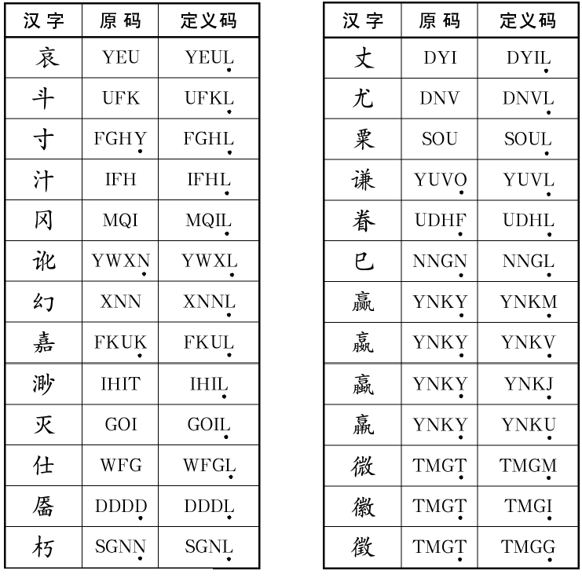

# 五笔教程高阶和补充

## 词语编码

词语都是 4 码输入。

- 二字词 `AB`：输入 A 的第一、二根+B 的第一、二字根（`一二一二`，取每字全码的前两码组成，共 4 个码，
- 三字词 `ABC`：输入 ABC 的第一字根 + C 的第二字根（`一一一二`，前两个字各取第一码，最后一个字取前两码，共 4 个码）
- 四字词 `ABCD`：依次输入 ABCD 的第一字根（`一一一一`，每字各取其第一个码，共 4 个码）
- 多字词 `ABC...N`：依次输入前三字（ABC）和最后一字（N）的第一个字根（`一二三末`，取第一、二、三及最后一个汉字的第一个码，共 4 个码）。

## 编码分类

- 全码：五笔大部分字全码为 4 码，另有较多一些 3 码字。
- 简码：为了减少击键次数，对常用字取其全码的前 1-3 个字根作为编码（最后加空格上屏，少量字的简码不是全码前缀）
- 重码：不同的字但是五笔编码相同，可通过数字键在候选窗口中选字。
- 无理码（定义后缀）：对重码的字，将原码最后一位人为改为其他键（一般为 L）。例如喜、嘉。（不一定都支持）
- 容错码：包括拆分容错、字型容错、无理码（定义后缀）。（大约 1000 个）
- 空码：“五笔字型”编码中不存在的编码，叫做空码。

## 容错码

- 编码容错：笔画顺序差异可能引起的错码
- 字型容错：上下型和杂合型区分引起的错码（能散不连）
- 定义后缀（无理码）：为减少重码而强制将最后 1-2 码修改成 L

  - 例子：“喜、嘉”都是 FKUK；但“喜”更常用而保持不变，所以“嘉”新增“FKUL”作为唯一码，而在“FKUK”中嘉可作为候选出现。

> 是因为以 L 为最后一码的编码空间冗余太大，又因为 L 键用右手无名指击键灵活方便。

部分定义后缀（无理码）参考（不一定都支持）：

## 补充

### Z 键

`Z` 键用处：

- 代替不会拆的部分
- 代替不确定字根位置的键位
- 代替不确定的识别码

### 三原理

王永民汉字键盘设计“三原理”：

- 相容性（C）：指各个键位上多个编码元素（字根）共处一键时，其相互之间的相关性。不相关时的重码少，效率高。相容性的量化指标，可以用重码的多少来表示。
- 规律性（R）：指各个键位以及整个键盘上，编码元素排列分布布局的规律性。规律性好的易学易记易用。具体量化指标，可以用某一布局和理想布局的差来表示，也可以用学员学习的易接受性加以测量。
- 协调性（U）：指各键位上编码元素的实用概率，是否与对应手指的击键能力相匹配，可用键位概率和手指击键能力系数之间的匹配情况定量描述。通常的建议：
  1. 中间排键位应当安排常用、频率高的编码元素（字根/码元），上排次之，下排最后。
  2. 食指、中指、无名指和小拇指的负担（击键频度）依次降低，
  3. 同一手指本排连击（减少越排操作）
  4. 左右手交替击键。

来源：

1. 王永民.(2005).计算机汉字键盘设计“三原理”——论计算机中文键盘的设计.计算机学报,28(5),12.
2. 王永民.(1994).五笔字型标准教材 1：培训教材.中国科学技术出版社
