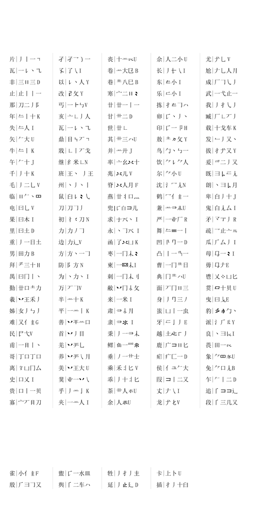

# 五笔拆字

## 五笔拆分顺序

五笔拆分顺序，容易出现不同笔画习惯的字，即用先左后右的自然顺序来拆分，比如：燕auKO，辔xlxK，等。
戈agnt，戊dnyT，等末笔都是右下角的撇，而不是右上角的点。类似的，九vtN，切avN，等末笔都是右下角的折（其中，刀vnT，单独打它时，临时变通一下笔顺，防止刀和九vtN字重码。）。

非djdD,由“三刂三”，强制成（hdHD，即“丨三丨三”【违反自然的拆分方式】）。
垂tgaF（丿一艹土），变成了垂tfaG（丿十一）即中间一竖是第3个笔画而早于其下笔画。
还有行tfHH（彳二丨），变成tgsH（彳一丁）；伞wuhJ（人䒑丨），变成wufJ（人丷十）。
喽kovG，女字经常误认成末笔为捺。末笔误读。

收nhTY，左边不是凵b字根，虽然字形接近，原意也可能相近，但这里是按严格笔画拆分。字根误读。
班gytG，中间不能当成“丨丿”j字根。
尴尬两字的偏旁是尢dnv不是九。
衣yeU，上下两部分中都超过两笔了，按上下形区分，识别码U；
只一笔，归为混合型，义yqI，亏fnv。识别误读。

“官”字，拆分为pnHN；其他版本的五笔，按标准笔顺拆分成phNN；
可是这种属于拆分惯性——尸nngt,己巳nngn，已经习惯于先折，习惯于先左框

靥dddl，蔻apfl，两个强制末码改成l的，为了避开其他常用字词，另外l键相对负担过小，可以作为强制末码经常规定一下以区分编码，这是王码推荐的，
比如，云fcul，寸fghl，等。这些就类似多重简码，yn 记 词，用记忆量来换速度

历史原因，造成的字形错码：象qjeU，盥qgiL，等，还有一些拆分歧义，蒙apgE，等等。

①“乘、乖”，分别拆分成“禾丬匕、丿十丬匕”（不能拆分成前两个单笔画：“丿一丬匕小、丿一丬匕丨”）。
对照的反例：“秉、重、束”，分别拆分成“丿一彐小、丿一日土、一口小（不能拆分成‘木口’）”。
而反例中“秉、束、重”这几个字，不能盲目地“取大优先”，因为字根之间“交叉”、“相交”（穿叉）得太厉害，那么“宁可拆分成单个笔画，也不拆分成‘交叉的字根’”。
②类似情况，“离、衮、亍、伞、兰、彦、拜”，分别拆分成“文凵冂厶、六厶𧘇（衣下部；有的网友的电脑可能显示不出来）、二丨、人䒑丨（第二个字根是‘丷+一’）、䒑二、立丿彡、龵（看字头）三十”。

（而不是拆分成“亠乂凵冂厶、亠八厶𧘇（衣下部）、一丁、人丷十、丷三、𰀆（立去横）厂彡、龵（看字头）”一三丨。）

③可是上述也不全对，“于、来、求”拆分成“一十、一米、一水丶”。
而不拆分成“二丨、二水、十（水无竖/⿰㇇⿱丿乀）丶”。
看样子，就是后几个字根取大优先。

④几个极端的取大优先的例字：
“年、舞、段”，拆分成“（𠂉+一；R键斤的形近字根）丨（左边小竖）十、（R键字根）（四道竖）夕匚丨、亻三几又”。

而没有拆分成“匚丨、𠂉一（四道竖）夕匚丨、丿丨三几又”。

这类主要是字形少见，拆分特别，初次遇到时，较难猜到，记住之后难度不大。

⑤最极端的交叉强拆，网友们开玩笑所说的“横竖都是二”的“井”字，真的拆分成两个二：“二刂”。

类似的还有：“篝：（竹字头）二刂一冂土”；“觏：二刂一冂土冂儿”。

“井、𠀎”（井加下方一横；觏：二刂一，这前三个字根组成的部分），因为在汉字中出现频率低，使用几率小，于是就没有收录为整个字根。（其他输入法有的会收录它们；但这就违背了减少字根量的原则，字根应该只收录最高使用频率的部首，不然部首有600到1000个之多，一不小心就会弄成一个字根过多到极不实用的输入法；因此，看到这类小几率字根时，在学习各类名不见经传的输入法的网友，应该警惕和清醒起来了，你掉进的这个天坑，可能比你和输入法作者预计的都要大，会累死人不偿命。）

## 五笔86版中历史遗留下来的错码

①因为字体变化，而出现的错码：
“象：日（横的；临的右下角横日）𧰨（豕无横）”（第二个字根，现在的字体已经变成“口”了）。
“盥：（乐无小；印左边无横）一水乙二皿”（现在的字体，是和舆一样的；“舆：亻二车乙二一八”）。

②为防止和常用字词重码，而故意保留的两个，强制末码使用L键的编码：“无理码”（没有理由的强制编码）
“靥：厂犬厂冂刂L（L键）”（正常拆分：“靥：厂犬厂冂刂三”；为了避免和“大DDDD”重码）。
“蔻：艹宀二儿⺊（卜）L（L键）”（正常拆分：“蔻：艹宀二儿⺊（卜）又”；为了避免和词组“劳动APFC”重码）。

比如还推荐：ynky：1.赢 2.羸 3.嬴 4.蠃（拆分为：亠乚口月‘贝羊女虫’几丶），也增加几个强制末码是L键的编码。

③有歧义拆分的编码，和前面的常用例字有冲突：
“蒙：艹冖一豕”（第三码应该取大优先，取“二”而不是“一”；对照：“亍：二丨”，甚至有“爰：爫二丿又”相交也优先取“二”字根）。
“旆：方𠂉一冂丨”（第二码应该取大优先，取“（𠂉+一）”；对照：“年：（𠂉+一）丨十”，“舞：（𠂉+一）（四道竖）一夕匚丨”）。

（“旆”字，因为有常用字“肺沛”中的“巿”字的直观印象，很容易拆分错误。

⑤制作输入法，删除容错码时，操作失误，留下的反而是错码：
“卢：⺊（卜）尸E（E是末笔识别码）”（实际上末笔识别码应该是R，作为上下型，而不是用E当作杂合型；对照“占：⺊（卜）口F（F是末笔识别码））。【二级简码可用】

⑥大字符集，偶尔有不太统一的拆分习惯。

比如：“軎：一日十口”没有使用繁体字根“車”拆分成“車口”，而在大字符集里面的繁体字过多，会大量使用繁体字根“車”。
再比如：“麸：（青字头）夕二人“，在大字符集中有的编码者喜欢把第二字根变成“夂”，造成前后不一致的情况。

---

五笔前两码，最多8个重码：
- tf 德 待 等 告 千 先 行 造；
- wy 集 今 领 令 念 住 信 依。

---

识别码用【】和大写字母强调。

## 五笔常用拆分部首例字总表

- 1 横起笔类：拜敖得夫无正酉下击未末遘井韦釜栽耕非考墙才求蛋亚事吏事囊再曹市丙寅本束柬朿术平来巫世甘其革辰灭太了丈兀尤万页成戌咸豖百甫不东练尧臣匹巨瓦既牙隆歹死爽于夹与屯捷夷严丌互拔
- 2 竖起笔类：卤监甩且面县典丹册冉巾央黑果单史里贵勤电曳申禺少扁而见免
- 3 撇起笔类：矢失千壬丢熏重垂牛缶卸制朱舞夭生告特我段升吒插秉舌毛午气长片卑囱丘舟殷斥所瓜舆爪币自身禹追角延乎豹乏臾鱼免风夜狗乌勿黎卯留勺曷饭久鸟卵氏乐
- 4 捺起笔类：恼亡鹿产亥州半羊着北渊觉兆脊并关首酋敝农义沈鹤祉补户良永
- 5 折起笔类：官遐尺快即丑爿尹庚庸隶弟弗敢刁臧卫出亟丞疏蛋那飞报予发刃互乡幽母贯杨书乜叉 Over!

另附几个易错汉字，有的在某些字体中显示不清楚。

- 寡薹隳圊酃彀觳鬯篪羹蔻靥夔酆鼎爿沔躞蹼臧凹凸軎。

为了减少重码，两个不常用字“靥、蔻”最后一码改成了 L。

- 象 qje
- 盥 qgi(l)，汉字字形微调，而五笔编码没变。

---

## 五笔常用拆分部首例字，详解

### 一、横起笔类

- 1 拜：手三十【丨】。rdfH。末笔丨，左右型算丨。识别码用【】和大写字母强调。
- 2 敖：王勹攵【丶】。gqtY。末笔捺，左右型，算丶。
- 3 得：彳日（一寸）。tj（gf）。（括号外二级简码不必拆全，常用字会熟，不常用不用记。）
- 4 夫：二人（【氵】）。fw（I）。末笔丶，杂合型，算氵。
- 5 无：二儿（【巛】）。fq（V）。末笔乙，杂合型，算巛。（不必专门强化末笔识别码。）
- 6 正：一止【三】。ghD。末笔一，杂合型，算三。常用字识别码会熟，不常用不必记熟。（“正常”打词组，如同每个字都最多只是二级简码，也可避开第 3 码开始的末笔识别码。）
- 7 酉：西一【三】。sgD。末笔一，杂合型，算三。
- 8 下：一卜（【氵】）。gh（I）。末笔丶，杂合型，算氵。 （和“正”字类似，只能拆出一个笔画，不能算上下型，而算杂合型。后面省略相关拆分与讲解。）
- 9 击：二山【川】。fmK。末笔丨，杂合型，算川。
- 10 未：二小【氵】。fiI。末笔丶杂合型算氵。
- 11 末：一木。gs（I）。末笔丶杂合型算氵。（省掉末笔识别码提示了，如不打它。）（和“未：二小”对比，容易记清。就是在区分常用 400 部首的拆分习惯。五笔无秘密。）
- 12 遘：二刂一（冂土）之。fjgp。
- 13 井：二刂【三】。fjK。末笔丨杂合型算川。
- 14 韦：二乙丨。fnh（K）。末笔丨杂合型算川。有简码 fnh。用得少，不必记。
- 15 釜：八乂干（丬）。wqf（u）。有简码 wqf。少用，别记。
- 16 栽：土戈木。fas（I）。末笔丶杂合型算氵。（五笔的末笔是最后一个字根的末笔。“木”末笔捺，不是“栽”字末笔画在右上角的点。）
- 17 耕：三小二刂。difj。
- 18 非：三刂三，末笔一杂合型算三。djdD。有简码 djd。
- 19 考：土丿一乙。ftgn。有简码 ftg。(三级简码也要加空格)
- 20 墙：土十丬（囗）口。ffuk。
- 21 才：十丿，末笔丿杂合型算彡。ftE。有简码 ft。
- 22 求：十、水无丨、丶，末笔丶杂合型算氵。fiyE。有简码 fiy。
- 23 蛋：乙止虫，末笔丶上下型算丷。nhjU。有简码 nhj。
- 24 丐：一卜乙，末笔乙杂合型算巛。ghnV。简码 ghn。
- 25 亚：一灬一，末笔一杂合型算三。gogD。
- 26 事：一口彐丨。gkvh。简码 gk。
- 27 吏：一口乂，末笔丶杂合型算氵。gkqI。简码 gkq。
- 28 囊：一口丨（冖口口二刂一）【衣无亠】。gkhe。有简码 gkh。
- 29 再：一冂土，末笔一杂合型算三。gmfD。gmf。
- 30 曹：一冂廿日｛ 是生僻字有的网友不显示而用廿代表，前面也有类似情况｝。gmaj。gma。
- 31 市：亠冂丨，末笔丨上下型算刂。ymhJ。
- 32 丙：一冂人，末笔丶杂合型算氵。gmwI。gmw。
- 33 寅：宀一由八。pgmw。pgm。
- 34 本：木一，末笔一杂合型算三。sgD。sg。
- 35 束：一口小，末笔丶杂合型算氵。gkiI。gki。（束，口字根截断了木字根，因此不取，木字根。五笔规则“兼顾直观”不硬拆。）
- 36 柬：一四小，末笔丶杂合型算氵。gliI。gli。
- 37 枣：一冂小冫。gmiu。
- 38 术：木丶，末笔丶杂合型算氵。syi。sy。
- 39 平：一丬丨，末笔丨杂合型算川。guhk。gu。（先取“丬”而不取成“丷”，是因为五笔第一条规则“取大优先”。五笔第二条规则“兼顾直观”排后面，而且只是“兼顾”，不是“优先”。）
- 40 来：一米，末笔丶杂合型算氵。goi。go。
- 41 巫：工人人，末笔丶杂合型算氵。awwI。aww。
- 42 世：廿乙，末笔乙杂合型算巛。anV。an。
- 43 甘：艹二【三】，末笔一杂合型算三。afD。
- 44 其：艹三八，末笔丶上下型算冫。adwU。adw。
- 45 革：廿、革无廿。末笔丨上下型算刂。afJ。af。
- 46 辰：厂、二、衣无亠，末笔丶杂合型算氵。dfeI。dfe。
- 47 灭：一火，末笔丶杂合型算氵（复习：拆分的上或下部分是单个笔画就不算上下型）。goI。
- 48 太：大丶，末笔丶杂合型算氵。dyI。dy。
- 49 了：了乙丨（字根：先打字根，再拆成笔画，前 2 末 1，共 4 码）。bnh。b。
- 50 丈：厂丶【氵】，末笔丶杂合型算氵。dyI。
- 51 兀：一儿【巛】，末笔乙杂合型算巛。gqV。
- 52 尤：犬无末笔、乚、【巛】，末笔是乙杂合型算巛（末字根的末笔）。dnV。
- 53 万：厂 【巛】，末笔乙杂合型算巛。dnV。
- 54 页：厂贝【冫】，末笔丶上下型算冫。dmU。
- 55 成：厂  乚（丶）丿｛五笔末笔是撇｝。dnnt。dn。
- 56 戌：厂一乚（丶）丿。dgnt。dgn。｛五笔末笔是撇，不是点，重码更少。｝
- 57 咸：厂一口（乚丶）丿。dgkt。dgk。
- 58 豖：豕丶，末笔丶杂合型算氵。eyI。
- 59 百：厂日，末笔一上下型算二。djF。dj。
- 60 甫：一月丨丶。gehy。geh。
- 61 不：一小，末笔丶杂合型算氵。giI。gi。i（一级简码可以不按拆分）。
- 62 东：七小，末笔丶杂合型算氵。aiI。ai。
- 63 练：纟七  八（不是东）。xanw。xan。
- 64 尧：七丿一儿。atgq。
- 65 臣：匚、丨、左框（凵朝左）、丨。ahnh。ahn。
- 66 匹：匚儿【巛】，末笔乙杂合型算巛。aqV。
- 67 巨：匚、左框、【巛】，末笔一杂合型算巛。anD。
- 68 瓦：一乚丶 （从左向右的顺序末笔折而不是点）。gnyn。gny。
- 69 既：彐厶匚儿。vcaq。vca。
- 70 牙：匚丨丿，末笔丿杂合型算彡。ahtE。aht。ah。
- 71 隆：阝夂一（丿）。btgg。btg。
- 72 歹：一夕，末笔丶杂合型算氵。gqI。
- 73 死：一夕匕，末笔乙上下型算巜（拆分的上部和下部不相连，虽然是单笔画）。gqxB。gqx。
- 74 爽：大乂乂（乂）乂。dqqq。dqq。
- 75 于：一十，末笔丨杂合型算川（上下相连且是单笔画）。gfK。gf。
- 76 夹：一丬人，末笔丶杂合型算氵。guwI。guw。
- 77 与：一乙一，末笔一杂合型算三。gngD。gng。gn。
- 78 屯：一凵乚，末笔乙杂合型算巛。gbnV。gbn。gb。
- 79 捷：扌一彐止。rgvh。rgv。
- 80 夷：一弓人，末笔丶杂合型算氵。gxwI。gxw。
- 81 严：一【业无一】厂，末笔丿上下型算 。godR。god。习惯改变【】不特指末笔识别码了。
- 82 丌：一刂，末笔丨杂合型算川。gjK。
- 83 互：一【母无 ÷】一，末笔一杂合型算三。gxgD。gxg。gx。
- 84 拔：扌【犬无末笔】又，末笔丶左右型算丶。rdcY。rdc。

### 二、竖起笔类

- 85 卤：卜囗乂，末笔丶上下型算丷。hlqU。hlq。hl。（现存的五笔，卤、卢算杂合型，应该是错的。参考占字上下型，拆分不是单笔画，算上下型。win10 微软五笔漏了 ywty 夜，4 码全码，只有 ywt 夜，3 码简码。QQ 五笔等可能还是错码 tvgs 梟，没正确码 wvgs 梟。）
- 86 监：刂 𠂉 丶皿。jtyl。
- 87 甩：用乙，末笔乙杂合型算巛。enV。en。
- 88 且：月一，末笔一杂合型算三。egD。eg。
- 89 面：厂冂刂三（不拆囗和国、粤区分开）。dmjd。dm。
- 90 县：月一厶，末笔丶上下型算丷。egcU。egc。
- 91 典：冂 龷 八。末笔丶上下型算丷。mawU。maw。
- 92 丹：冂亠【三】。myD。
- 93 册：冂冂（一【三】）。mm(gD)。顺路可知 mmgD 凹，第一字根是几，常用就记，不常用打临时拼音 aotu 凹凸，速度解决也可以。刚练五笔，删拼音输入法为强化五笔习惯，真实用，不必极端。
- 94 冉：冂土【三】。mfD。
- 95 巾：冂丨【川】。mhK。
- 96 央：冂大。md。简单着来，用不到末笔识别码时，就不提了。
- 97 黑：四土灬。lfo。
- 98 果：日木。js。
- 99 单：丷日十【刂】。ujfJ。末笔竖，上下型，算刂。末笔识别码不再解释，看上面学习。
- 100 史：口乂。口乂。
- 101 里：日土【三】。jfD。
- 102 贵：口丨一贝。khgm。
- 103 勤：廿口王力。akgl。王，指，青上，这字根（龶），有的网友不显示。下面不再解释。
- 104 电：日乙。jn。
- 105 曳：日匕【彡】。jxE。
- 106 申：日丨【川】。jhK。
- 107 禺：日冂丨丶。jmhy。
- 108 少：小丿。it。
- 109 扁：丶尸冂卄。ynma。
- 110 而：厂冂刂。dmj。
- 111 见：冂儿【巜】。mqB。
- 112 免：勹口儿。qkq。

### 三、撇起笔类

- 113 矢：𠂉 大【冫】。tdU。
- 114 失：牛无丨、人。rw。
- 115 千：丿十【川】。tfK。
- 116 壬：丿士【三】。tfD。
- 117 丢：丿土厶。tfc。
- 118 熏：丿一四（土灬）。tgl(fo)。
- 119 重：丿一日（土）。tgj(f)。
- 120 垂：丿一卄（土）。tga(f)。三字一样的拆分习惯，习惯，五笔无秘密可言，就人用的习惯。
- 121 牛：牛无丨、丨、【川】。rhK。
- 122 缶：牛无丨、山、【川】。rmK。一般只是上下型和杂合型，猜一下，猜不透就杂合型。
- 123 卸：牛无丨、止、卩。rhb。
- 124 制：牛无丨、冂、丨、刂。rmhj。
- 125 朱：牛无丨、小。ri。牛无丨，这类常用字根，就算再奇怪，因为各字常见，再难也不难了。
- 126 舞：牛无丨、四竖、一（、夕、匸、丨）。rlg(qah)。四竖，这类极少出现的反而是难点。
- 127 夭：丿大【氵】。tdI。
- 128 生：丿王。tg。
- 129 告：丿土口【二】。tfkF。
- 130 特：丿扌土（寸）。trf(f)。
- 131 我：丿扌乚（丶丿）。trn(yt)。我 q，一级简码。俄等字才用到拆分我。
- 132 段：亻三几（又）。wdm(c)。
- 133 升：丿廾【川】。taK。
- 134 吒：口丿七【乙】。ktaN。
- 135 插：扌丿十（臼）。rtf(v)。
- 136 秉：丿一彐（小）。tgv（i）。
- 137 舌：丿古【三】。tdD。
- 138 毛：丿二乚。tfn。
- 139 午：𠂉 十【刂】。tfJ。
- 140 气：牛无丨、乙、【巜】。rnB。
- 141 长：丿七（乀）。ta（y）。
- 142 片：丿丨一（）。thg(n)。
- 143 卑：白丿十【刂】。rtfJ。
- 144 囱：丿囗夕【氵】。tlqI。
- 145 丘：斤一【三】。rgD。
- 146 舟：丿月【氵】。teI。
- 147 殷： 彐 。rvn。
- 148 斥：斤丶【氵】。ryI。
- 149 所：、左框（凵朝左）。rn。
- 150 瓜： 厶乀。rcy。
- 151 舆：亻二车（ 二一八）。wfl(nfgw)。
- 152 爪： 丨乀【氵】。rhyI。
- 153 币：丿冂丨。tmh。
- 154 自：丿目【三】。thD。
- 155 身：丿冂三（丿）。tmd（t）。
- 156 禹：丿口冂（丨一丶）。tkm（hgy）。
- 157 追：亻、左框、左框、之。wnnp。
- 158 角：勹用。qe。
- 159 延：丿止廴（【三】）。thp(D)。半包围，末字根取止，末笔横杂合型。国标笔画已变折。
- 160 乎：丿丬丨。tuh。
- 161 豹：豸上（爫）、豸下（豕）、勹、丶。eeqy。
- 162 乏：丿之【氵】。tpI。
- 163 臾：臼人。vw。
- 164 鱼：鱼无一、一、【二】。分开的单笔画，不是杂合型，还是上下型。
- 165 免：勹口儿。qkq。
- 166 风：几乂。mq。
- 167 夜：亠亻夂（丶）。ywt（y）。
- 168 狗：勹丿勹（口）。qtq（k）。
- 169 乌：勹乙一。qng。
- 170 勿：勹、丿丿、【彡】。qrE。
- 171 黎：禾勹丿（人水）。tqt(wi)。
- 172 卯：勹丿卩【丨】。qtbH。
- 173 留：勹丶刀田。qyvl。
- 174 勺：勹丶【氵】。qyI。三级简码时，“勺”字在“久”字后 qyI 久、勺、夊。qy 久。
- 175 曷：日勹人乚。jqwn。
- 176 饭：勹乚 （又）。qnr（c）。
- 177 久：勹乀。qy。
- 178 鸟：勹丶乙一。qyng。
- 179 卵：勹丶丿（卩丶）。qyt(by)。
- 180 氏：勹七。qa。
- 181 乐：勹小。qi。

### 四、捺起笔类

- 182 恼：忄文凵。nyb。
- 183 亡：亠乚【巛】。ynV。
- 184 鹿：广、左框、刂。ynj。
- 185 产：立丿【彡】。utE。一级简码 u。
- 186 亥：亠乚丿人。yntw。
- 187 州：丶丿丶（丨丶）丨。yty（hy）h。
- 188 半：丬十。uf。
- 189 羊：丷、羊下、【刂】。udJ。
- 190 着：丷、羊下、目。udh。
- 191 北：丬匕。ux。
- 192 渊：氵丿米（丨）。ito(h)。
- 193 觉：氵冖冂儿。ipmq。
- 194 兆：水无丨、儿、【巛】。iqV。
- 195 脊：水无丨、人、月。
- 196 并：丬廾。ua。
- 197 关：丬大。ud。
- 198 首：丬丿目。uth。
- 199 酋：丬西一【二】。usgF。
- 200 敝：丷冂小（攵）。umi(t)。
- 201 农：冖、衣下、【氵】。peI。
- 202 义：丶乂。yq。
- 203 沈：氵冖儿。ipq。
- 204 鹤：冖、亻、隹右。pwy。
- 205 祉：之丶止。pyh。
- 206 补：之冫卜。puh。
- 207 户：丶尸【彡】。ynE。
- 208 良：丶、彐（、衣下）。yv(e)。
- 209 永：丶、、水无丨。yni。

### 五、折起笔类

- 210 官：宀、左框（、丨、左框）。pn（hn）。
- 211 遐：左框、丨、二（、左框、又、之）。nhf（ncp）。
- 212 尺：尸乀【氵】。nyI。
- 213 快：忄、左框、人。nnw。
- 214 即：彐厶卩。vcb。
- 215 丑： 土【三】。nfD。
- 216 爿：乚丨厂【彡】。nhdE。
- 217 尹：彐丿【彡】。vtE。
- 218 庚：广彐人。yvw。
- 219 庸：广彐月丨。yveh。
- 220 隶：彐水【氵】。viI。
- 221 弟：丷弓丨（丿）。uxh（丿）。
- 222 弗：弓刂【川】。xjK。
- 223 敢： 耳（攵）。nb（t）。
- 224 刁： 一【三】。ngD。
- 225 臧：厂乚丆（匸、丨、左框、丨、乚、丶、丿）。dnd(ahnhnyt)。
- 226 卫：卩一。bg。
- 227 出：凵山。bm。
- 228 亟：了口又。bkc。
- 229 丞：了、水无丨、一。big。
- 230 疏：乛止亠。nhy。
- 231 蛋：乛止虫。nhj。
- 232 那：刀二阝。vfb。
- 233 飞： 冫【氵】。nuI。
- 234 报：扌卩。rb。
- 235 予： 卩【刂】。cbJ。
- 236 发：乚丿又丶。ntcy。一级简码 v。
- 237 刃：刀丶【氵】。vyI。
- 238 互：一、母无 ÷（、一）。gx（一）。
- 239 乡：幺无丶、丿、【彡】。xtE。
- 240 幽：幺幺山。xxm。
- 241 母：母无 ÷、一、冫。xgu。
- 242 贯：母无 ÷、十、贝。xfm。
- 243 杨：木、乙（、丿丿、【丿】）。sn(rT)。末笔撇，左右型。
- 244 书：乛  丨（丶）。nnh(y)。
- 245 乜： 乚【巛】。nnV。末笔折，杂合型。
- 246 叉：又丶【氵】。cyI。末笔点（捺），杂合型。

### 六、强制改的

为了减少重码，两个不常用字“靥、蔻”最后一码改成了 L。
强制改的，不和“大、劳动”这 2 个常用字词重码，难记却容易练快。

- 靥：厂犬丆（冂刂）三 L，dddL（正常拆分编码 dddd，偶尔有的五笔是正常编码 dddd）。
- 蔻：艹宀二（儿卜）又 L，apfL（正常编码 apfc，偶尔有的五笔是正常编码 apfc）。

### 七、易错汉字

另附几个易错汉字，有的在某些字体中显示不清楚。

- 寡：宀厂月（一八刀）。pde（gwv）。（不是，夏：厂目攵，dht。）
- 薹：艹士口（冖一厶）土 afk（pgc）f。蒜薹，一般手写错成，蒜苔。
- 隳：阝厂工（……略）心。bdan。以前字体模糊，借用堕字型，简化显示，容易错。
- 圊：囗王月【三】。lgeD。月显示不清。
- 酃：雨口口（……略）阝。fkkb。以前字体模糊，却借用其他字形，错误显示。下同。
- 彀：士冖一又。fpgc。
- 觳：士冖一又。fpgc。
- 鬯：乂灬凵。qob。（模糊记得是犀牛或相关，不打古文，不常用的不用记，哪怕是简码。）
- 篪：、、虎无几、几。trhm。搋：扌、、虎无几、几。
- 羹：丷王灬大。ugod。
- 蔻：艹宀二（又）L。apfL。
- 靥：厂犬厂（三）L。dddL。
- 夔：丬止丿（目己八夂）。uht（hnwt）。按从左向右的顺序拆分。
- 酆：三丨三（丨山一口丬）阝。dhdb。
- 鼎：目乙丆。hnd。
- 爿：乚丨丆【彡】。nhdE。
- 沔：氵一丨。igh。笔画易错。
- 躞：口止火（言火）又。khoc。还是从左向右顺序拆分。
- 蹼：口止灬一（丷、羊下、乀）kho（y）。不是美，不是大。
- 臧：厂乚丆。dnd。习惯性先拆字根厂，好记好用。万丈成戊戌戍臧，统一好记好用。
- 凹：几冂一【三】。mmgD。
- 凸：丨一冂（一）。hgm(g)。
  = 軎：一日十口。gjfk。就是，車，这个繁体字根，开始时还没加上，就拆了。

## 生僻字

GBK 生僻字中增加的繁体字根有 17 个

- 亞 ghgg(gfgd)中部（去上下各一横）F
- 長 deu 上部（去衣下部字根即去除无“亠丿”部分）D；
- 斉 yjff(yjf) 下部（去文）J、肅 vhth(vfjk)下外部（去彐十）J
- 軎 gjfk（lkf）上部（去口即车的繁体車 lghh）L、婁 kgkv(lvf)上部（去女）L
- 貝 mhny 贝的繁体（整个）M；
- 釒 qtyg 钅的繁体（整个）Q；
- 齊 yvuf(yjf)上部（去下部繁体字根 J）
- 門 uhng 门的繁体（整个）U
- 鬯 qobx（obxb）上内部（斜着的米即乂和四点）O
- 飠 wyvc（wpu）下部（去人）（仅用于拆分繁体飠部时）P；
- 齒 hwwb(hbj)下部（去止）B
- 舆 wflw（vlgw）上外部（去“车一八”即散开的臼字根）V
- 馬 cghy 马的繁体（整个）C
- 黽 mggv(xhng)（整个）X、龜 tmgg(txd)下部（去丿）X。

- 龜 tmgg(txd)下部（去丿）X。（“丿”有时能正常显示而有时又显示成“”即负头部（无贝）
- 眾 lwwy(容错 lwww)(容错 lwwu)右下角那个“人”字，有时显示成两个点或者“丿踩乀”的样子

GBK 难字（括号内是使用繁体字根的编码）:

- 亞 ghgg(gfgd)
- 長 deu
- 肅 vhth(vfjk)
- 斉 yjff(yjf)
- 婁 kgkv(lvf)
- 車 lghh
- 貝 mhny
- 釒 qtyg
- 齊 yvuf(yjf)
- 齏 yvug(yjdg)
- 門 uhng
- 鹵 hlqo(hlou)
- 飲 wyvw(wpqw)
- 飮 wyvw
- 齒 hwwb(hbj)
- 臖 wfme(vmge)
- 馬 cghy
- 龜 tmgg(txd)
- 櫷 stmg(stxg)
- 黽 mggv(xhng)
- 僶 wmgv(wxg)
- 丣 gajn
- 丱 njhg
- 麥 swwt
- 麺 gtdd
- 亙 ghng(gqug)
- 韋 nhkh
- 桟 sdxy
- 帶 aqph
- 眾 lwwy(lwww)(lwwu)
- 䜌 xyxy
- 飛 nuth(nutj)
- 奊 ffgy
- 丏 ghnn
- 彧 akge(gkgy)
- 雋 wymm
- 鳥 wvgo
- 鳳 mdho
- GB 难字:
- 曳 jxe
- 拽 rjxt
- 象 qjeu
- 蔻 apfl
- 靥 dddl
- 拜 rdfh
- 幽 xxmk
- 酆 dhdb
- 嗤 kbhj
- 鼎 hndn
- 臧 dndt
- 爿 nhde
- 舞 rlgh
- 舆 wflw
- 段 wdmc
- 越 fhat
- 蹼 khoy
- 寡 pdev
- 凹 mmgd
- 凸 hgmg
- 卍 nhgh
- 卐 nghg
- 沔 ighn
- 鬯 qobx
- 齑 ydjj
- 曹 gmaj
- 典 mawu
- 身 tmdt
- 燮 oyoc
- 盥 qgil（少量是长期以来的错码）

gb18030-2000(CJK-a)：

- 㐃 lhK，三角是框类归到 L 字根，类似 GBK 区生字，
- llll 〇，也直接归到框类 L 字根，且直接给了这个强制码，省得拆笔画又费神。

错码

- tvgs 梟，应该是 wvgs 梟，
- wyvd 餸，应该是 wyvp 餸。
