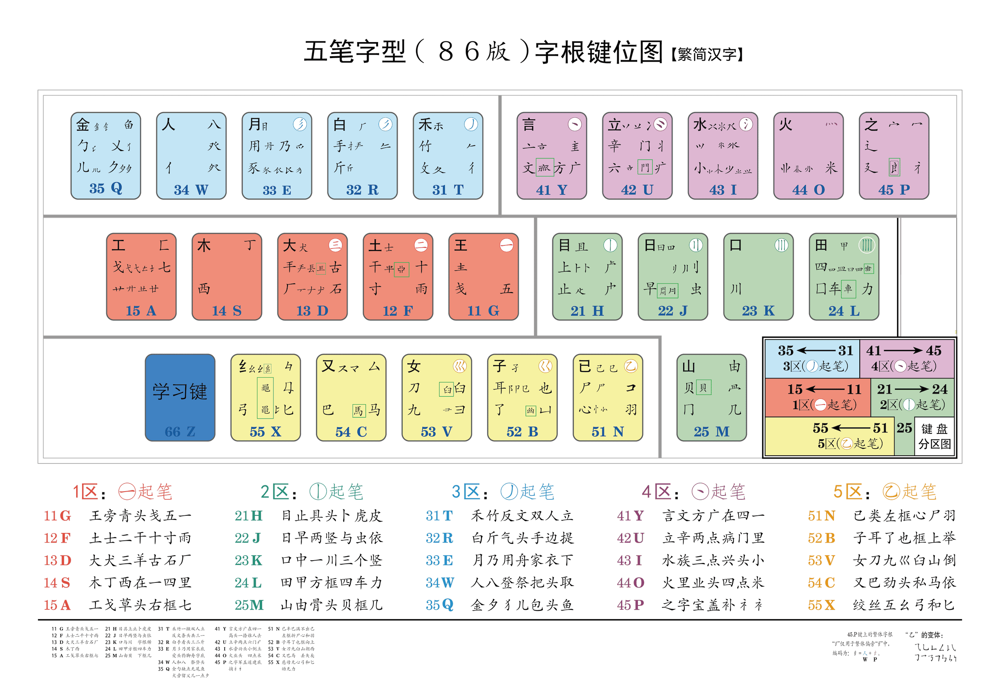

<link rel="stylesheet" type="text/css" href="../../static/css/fonts.css" />

## 字根图

## 字根总表

{{ read_csv("./data/roots-table.tsv", sep="\t", engine="python") }}

!!! note "备注"

    折（``）还包括：  
      - 顺时针 ``等  
      - 逆时针 ``等

## 字根助记

{{ read_csv("./data/roots-mnemonic.tsv", sep="\t", engine="python") }}
