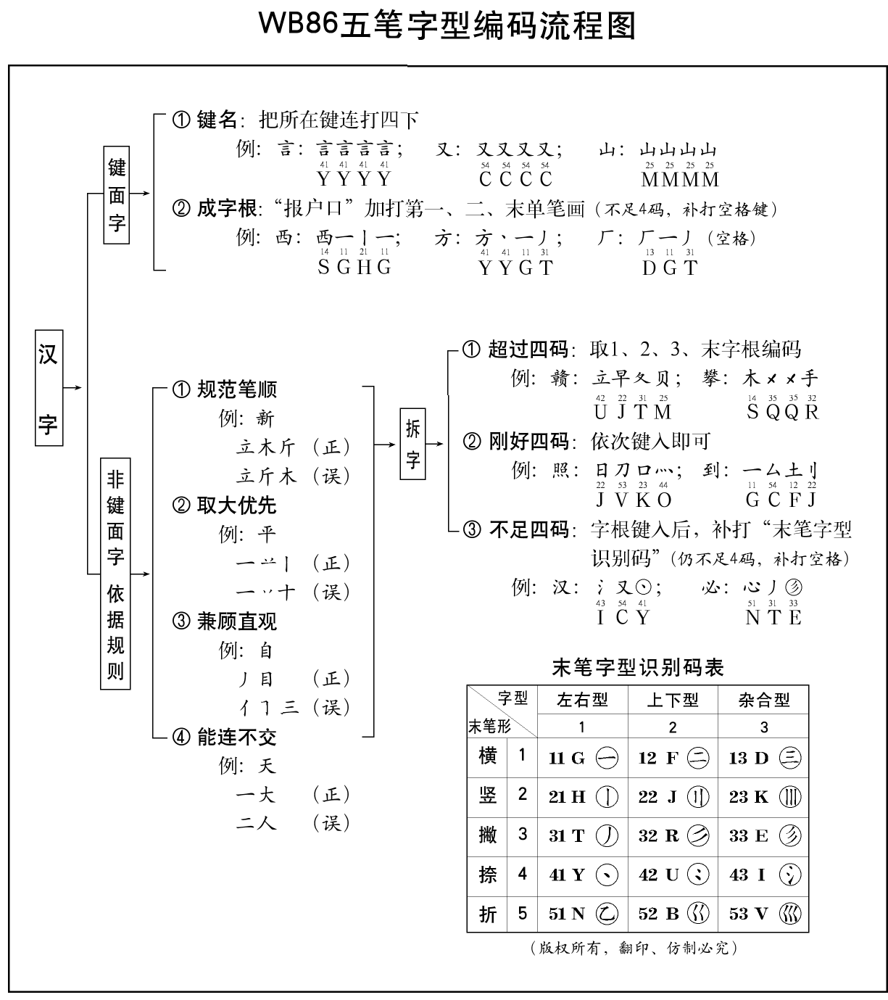

# 五笔简明教程

## 汉字结构

### 笔画和字根

汉字基本笔画分为：横（提）、竖（竖钩）、撇、捺（点）、折。五笔将组字部件按起笔类型等分类，故称“五笔”。

字根是五笔字型输入法对组字部件的称呼，也叫码元。五笔中将所有部件分类为 5 区（横竖撇捺折），每区各分配 5 个键位，共 25 键，同时编码方案最多 4 键可能完成单字输出。优势是整体重码率较低。
目前，五笔基本字根大约 130 个，加上变形字根超过共 200 个，后续版本为了支持大字符集等，又适当引入了一些字根及其变形，总计超过 300 个。

### 字型结构

| 五笔分类           | 结构参考         | 举例               | 说明                             |
| ------------------ | ---------------- | ------------------ | -------------------------------- |
| 左右型（1 型）     | ⿰⿲             | 汉湘结封           | 包括左右、左中右结构             |
| 上下型（2 型）     | ⿱⿳             | 字莫花华           | 包括上下、上中下结构             |
| 杂合型（3 型）[^1] | ⿴⿵⿶⿷⿸⿹⿺⿻ | 国同函医厅司这乘本 | 其他结构：独体字、半包围、全包围 |

[^1]: 更早期的五笔中，杂合型分类：“外内型”（3 型，包围结构以及类似“巫”的结构）和“单体”型（4 型，独体）。

### 字根关系

用于构成汉字的字根之间，在五笔中归类为四种关系：

1. **单**：字根本身就是一个汉字，不存在字根间关系（拆字时没有第二字根），如 5 种基本笔画，25 个键名字根，以及“石雨”等成字字根；
2. **散**：构成汉字的字根之间存在间距，可分离，视为“散”。如：苗（艹+田）、昌（曰+曰）；
3. **连**：一个字根和一个单笔画相连，但不相交，视为“连”。如：尺（尸+㇏）、且（月+一）、正（一+止）；
  - 【特殊 1】：“勺、术、太、头”等，一个字根加点构成汉字，即使有间距，也视为“连”。
  - 【特殊 2】：“足、充、首、左、页”等虽然连着，但是拆字时“可散可连”，五笔中优先判断为“散”。【能散不连】
  - 【补充】：“个、少、么、旦、全”，单笔画（不是点）和字根有明显间距，也是不相连，判断为“散”。
4. **交**：两个或多个字根交叉重叠（即有笔画相交），视为“交”。如：本（木+一）、申（日+丨）。

本身是字根的字都是**单**，而一般需要拆字组合的字，需要判断其“散、连、交”的关系，
其中“散”可进一步判断“左右”还是“上下”型，所有字根间都是“连、交”的字一般都是“杂合”型。

## 五笔字根

### 字根分区

按字根起笔笔画，分为五个“区”，每个区分配五个键位，如下：

| 起笔       | 区号 | 字母键位                       | 区位号             |
| ---------- | ---- | ------------------------------ | ------------------ |
| 横（提）   | 1 区 | G、F、D、S、A（键盘中排）      | 11、12、13、14、15 |
| 竖（竖钩） | 2 区 | H、J、K、L（中排）和 M（下排） | 21、22、23、24、25 |
| 撇         | 3 区 | T、R、E、W、Q（上排）          | 31、32、33、34、35 |
| 捺（点）   | 4 区 | Y、U、I、O、P（上排）          | 41、42、43、44、45 |
| 折         | 5 区 | N、B、V、C、X（下排）          | 51、52、53、54、55 |

### 字根规律

字根构成：基本字根（主字根）总数 130 多，其他辅助字根包括：

- 同源字根，如：心-忄等；水-氵氺；手-扌；耳-阝等；
- 形似字根，如：艹-廿；已-己巳㔾等；

字根分布：

1. 字根的区号与字根首笔代号一致：
  - 例如：起笔为横等字根的都在一区
2. 字根的位号与字根的次笔代号一致：
  - 例如：王（一一，11 区）、白（丿丨，32 区）
3. 笔画字根，单笔画的“个数”与其所在键的“位号”一致：
  - “一、丨、丿、丶、乙”都在相应区的第 1 位；
  - “二、刂、冫、巜”等都在各区的第 2 位；
  - “三、川、彡、氵、巛”都在各区的第 3 位；
  - “灬”等都在相应区的第 4 位。
4. 辅助字根，与主要字根形态相近或渊源一致
5. 个别例外
  - 车、力
  - 心

### 字根表

详见：[字根表](./roots.md)

## 单字编码

### 编码规则

截长补短：全码最多 4 码，2-3 码先补识别码再补空格键，超过 4 码的取“一二三末”。（1 码字即字根字，不需要拆字，有特殊约定）。



### 字根汉字

字根汉字，也叫键面字，即整字就是字根表上的字根，可以分成：

1. 笔画字根：共 5 个。即“一丨丿丶乙”（其中“丶”部分输入可能支持“㇏”），其中“一乙”是常规汉字，其他一般仅是为笔画。
2. 键名字根：共 25 个。通常助记口诀中第一个汉字（五笔字根图中一般位于按键左上加粗加大的汉字），其中 X 对应字“经”（而非“纟”）
3. 成字字根：除了笔画、键名的字根，大约 60 多个（加上偏旁部首超过 100）。
4. 其他字根：包括偏旁部首和其他拆分字根。是偏旁部首的字根（一般字符集有编码），参考成字字根方式输入；其他的一般不能输入而仅用于拆字。

#### 笔画字根

输入方法：按所在键位两次，再按两次 `L` 键。（强制规定，主要是将简短的编码“让位”给更常用的字，）

| 字    | 五笔   |
| ----- | ------ |
| 一    | `ggll` |
| 丨    | `hhll` |
| 丿    | `ttll` |
| 丶/㇏ | `yyll` |
| 乙    | `nnll` |

#### 键名字根

输入方法：按所在键位四次。

- 例子：

```
王 gggg
金 qqqq
女 vvvv
```

- 完整列表

|            | 1      | 2      | 3      | 4      | 5      |
| ---------- | ------ | ------ | ------ | ------ | ------ |
| 横区（一） |        |        |        |        |        |
|            | 王 `G` | 土 `F` | 大 `D` | 木 `S` | 工 `A` |
| 竖区（丨） |        |        |        |        |        |
|            | 目 `H` | 日 `J` | 口 `K` | 田 `L` | 山 `M` |
| 撇区（丿） |        |        |        |        |        |
|            | 禾 `T` | 白 `R` | 月 `E` | 人 `W` | 金 `Q` |
| 捺区（丶） |        |        |        |        |        |
|            | 言 `Y` | 立 `U` | 水 `I` | 火 `O` | 之 `P` |
| 折区（乙） |        |        |        |        |        |
|            | 已 `N` | 子 `B` | 女 `V` | 又 `C` | 经 `X` |

#### 成字字根

输入方法：键名+首笔+次笔+末笔代码。 （俗称“报户口、加笔画”。不足补空格键，其中首笔、次笔、末笔都是指单个笔画）

- 参考列表（不完整）

|            | 1          | 2            | 3          | 4        | 5      |
| ---------- | ---------- | ------------ | ---------- | -------- | ------ |
| 横区（一） |            |              |            |          |        |
|            | `G`        | `F`          | `D`        | `S`      | `A`    |
| （19 个）  | 戋五一     | 士二干十寸雨 | 犬三古石厂 | 丁西     | 戈弋七 |
| 竖区（丨） |            |              |            |          |        |
|            | `H`        | `J`          | `K`        | `L`      | `M`    |
| （13 个）  | 上止卜     | 早虫         | 川         | 甲四车力 | 由贝几 |
| 撇区（丿） |            |              |            |          |        |
|            | `T`        | `R`          | `E`        | `W`      | `Q`    |
| （8 个）   | 竹         | 手斤         | 乃用       | 八       | 儿夕   |
| 捺区（丶） |            |              |            |          |        |
|            | `Y`        | `U`          | `I`        | `O`      | `P`    |
| （8 个）   | 文方广     | 辛六门       | 小         | 米       |        |
| 折区（乙） |            |              |            |          |        |
|            | `N`        | `B`          | `V`        | `C`      | `X`    |
| （16 个）  | 己巳尸心羽 | 耳了也       | 刀九臼     | 巴马     | 幺弓匕 |

### 一般汉字

即除了字根汉字的字，也叫合体字、键外字、非键面字。这些字都是字根或者基础笔画拼成。

先按拆字规则（主要是笔顺和取大）拆分若干字根，然后依次输入字根所在键位：

- 字根数大于等于 4：按书写顺序，取第一字根+第二字根+第三字根+最末字根。（`一二三末`）
- 字根数等于 3：第一字根+第二字根+第三字根+识别码所在键。（`一二三码`）
- 字根数等于 2：第一字根+第二字根+识别码+空格（不足四码补空格键）。（`一二码空`）

识别码是由汉字“末笔”代号加“字型”代号而构成的一个附加码，即末笔画类型（横 1 竖 2 撇 3 捺 4 折 5） × 字结构（左右 1、上下 2、杂合 3），相见[下文](#识别码)。

## 五笔拆字

### 拆字原则

注意下面规则一般有优先级（一般前三条足够了）：

1. 书写顺序：从左到右，从上往下，先内后外，先中间后两边等（优先参考国标规范笔顺，部分编码有特殊规律）；
2. 取大优先：拆成已知最大字根，并且笔画能不中断。
  俗称“尽量往前凑”，要以“再增添一个笔画，便不能构成笔画更多的字根”为限度，拆取“笔画尽可能多”的结构作为字根，这叫做“取大优先”。
  - 果=日+木。
  - 半=【丷一】+十。
  - 产=立+丿
3. 兼顾直观：适当忽视笔顺要求，合成更大的字根，一般是“散”的结构
  - 国=囗+王+丶
  - 丰=三+丨（也符合“取大优先”）
  - 自=丿+目
  - 或=戈+口+弋
4. 能连不交：一般来说，“连”比“交”更为“直观”。
  - 天=一+大 ~~二+人~~ （单笔画+字根相连=“连”）
  - 于=一+十 ~~二+亅~~
  - 午=【丿一】+十 ~~【丿二】+丨~~ 【？为何参考直观：丿+干】
  - 牛=【丿二】+丨 ~~【丿一】+十~~ (都相交，取大优先)
  - 未=二+小；末=一+木 （“未”符合取大，更常用；“末”强制修改，减少重码。）【特殊】
5. 能散不连
  - 占=卜+口 【能散能连，非单笔画取“散”；散->“上下型”】
  - 矢=【丿一】+大

> 当遇到这种既能“散”，又能“连”的情况时，规定：只要不是单笔画，一律按“能散不连”判别，即优先确定为“散”的关系。

### 识别码

目的：对于字根少的字（即只有 2-3 个字根），引入字型结构信息区别，降低重码率。

重码例子：

- 吧=口+巴；邑=口+巴
- 洒=氵+西；沐=氵+木；汀=氵+丁 （字根“木丁西”均在 14 区/S 键）

规则：识别码=末笔代码（5 个）+字型代码（3 个）

|           | 末笔横(1) | 末笔竖(2) | 末笔撇(3) | 末笔捺(4) | 末笔折(5) |
| --------- | --------- | --------- | --------- | --------- | --------- |
| 左右型(1) | G(11)     | H(21)     | T(31)     | Y(41)     | N(51)     |
| 上下型(2) | F(12)     | J(22)     | R(32)     | U(42)     | B(52)     |
| 杂合型(3) | D(13)     | K(23)     | K(33)     | I(43)     | V(53)     |

### 特殊规定

#### 约定 1 （囗辶廴被围末笔）

- 含有“辶、廴”的半包围和全包围结构，以包围中的字末笔作为识别码末笔（用于提高区分能力）

- 注意：
  - “囗+字根”的双编码字根结尾的：因、烟、茵（识别末笔都去最后字根“大”的末笔“丶”）
  - “辶+字根”的双编码字根结尾的：正常取末笔（即“辶”的末笔“㇏”）【例外】

#### 约定 2（刀和力末笔为折）

- 还有字根“九、刀、力、七、匕”等识别末笔一律用“折笔”。（注意，按国家规范笔顺最后不全折）

#### 约定 3（戈字类末笔为丿）

- 我、戋、成、龙、成、找等含有“戈”等识别末笔取丿（从上到下取丿。按国家规范先撇后点，而台湾地区笔顺先点后撇。王码 86-10830 有修正）
  【起源字部分人书写中的倒插笔习惯】

#### 约定 4（独点字末笔为丶）

- “义、太、勺”等单独带点等字，末笔取点（由于字根+点视为相连，作为杂合型，所以识别码基本都是`I`）

### 杂合型补充

- 一个基本字根和单笔画相连的字，也作为杂合型，比如“自、千、尺、本”（因为视为“连”）；
- 一个基本字根和孤立点构成的字，也作为杂合型，比如“勺、术、太、斗”（因为视为“连”）。
